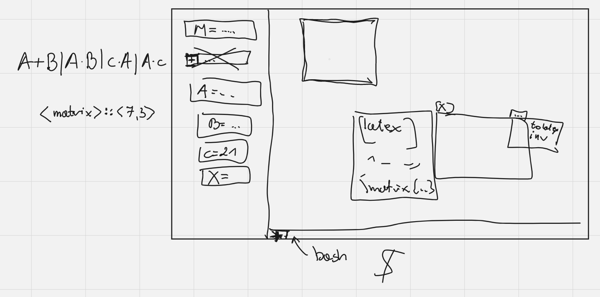

# Just Pure 2D Graphics Matrix Display

## Authors
- Mieszko Grodzicki [@mgr0dzicki][#MieszkoGH]
- Alek Tudruj [@tudny][#AlekGH]

---

## Description
**Just Pure 2D Graphics Matrix Display** (*JP2GMD*) is a powerful matrix calculator. 

It allows you to perform basic operations on matrices, such as addition, subtraction, multiplication, and division.
It also allows you to perform more advanced operations, such as finding the determinant, the inverse, and the transpose of a matrix.

One of its most powerful features is the ability to generate `LaTeX` code for the matrix you are working with and all the operations you perform on it.

---

## Installation
Install dependencies if applicable:

Ubuntu
```bash
sudo apt-get install libfontconfig libfontconfig1-dev cmake xorg-dev libxcb-shape0-dev libxcb-xfixes0-dev
```

Run the program:
```bash
$ bazel run //:jp2gmd
```

Check program help using
```bash
$ bazel run //:jp2gmd -- --help
```

# Usage
Check out [the guide](GUIDE.md).

# Development
## Plan
- [X] 1.1. Implement rational numbers representation.
- [X] 1.2. Implement matrix module for given any number representation.
- [X] 1.3. Implement basic operations on matrices.
- [X] 1.4. Implement `LaTeX` code generation.
- [X] 2.1. Implement GUI.
- [ ] ~~2.2. Extend the number representation module to allow for more sophisticated numbers.~~
- [ ] ~~2.3. Implement complex operations on matrices.~~

and all other things added as GH Issues.
Issue marked [NITD] (Not Intended To be Developed) 
are ideas taken into consideration when 
developing more critical features. They are not 
intended to be developed during the JNP3 project - 
maybe in the future if time allows.

## GUI Preview


## Libraries
- [egui](https://crates.io/crates/egui) - (https://github.com/emilk/egui)
- [num](https://docs.rs/num/latest/num/)


[#MieszkoGH]: https://github.com/mgr0dzicki
[#AlekGH]: https://github.com/tudny
